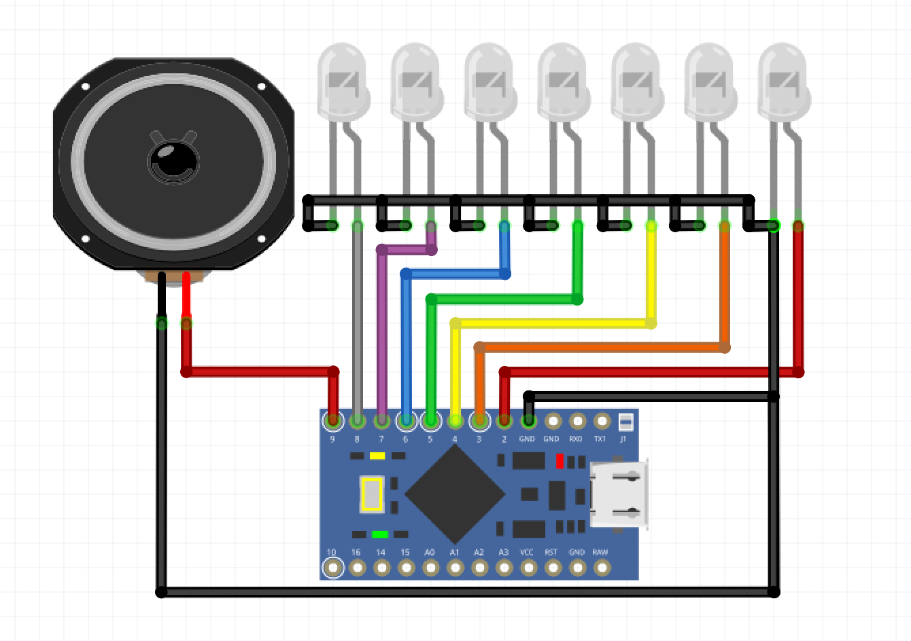

#### 文件含意
|文件名|含义|
|--|--|
|ArduinoMusic.ino|主文件，歌曲数据以及播放代码|
|Tonelib.h|头文件，定义了每个音调频率，音调对应点亮的LED，和节拍长短|
|transfer.html|乐谱转换工具，直观输入乐谱转换为程序可用的编码|
|ArduinoMusic.fzz|接线图纸文件|

#### 转换工具
[点此进入转换工具](//troncool.github.io/practice/Arduino/ArduinoMusic/transfer.html)

#### 接线方式
1. 喇叭，接10和GND。10可以在程序里设置成其它Pin。
2. LED, 低中高音1234567，对应2-8这7个LED。可以在Tonelib.h里的port方法中设置成其它Pin。

